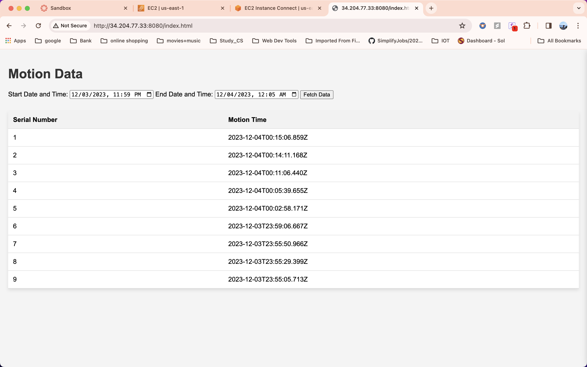
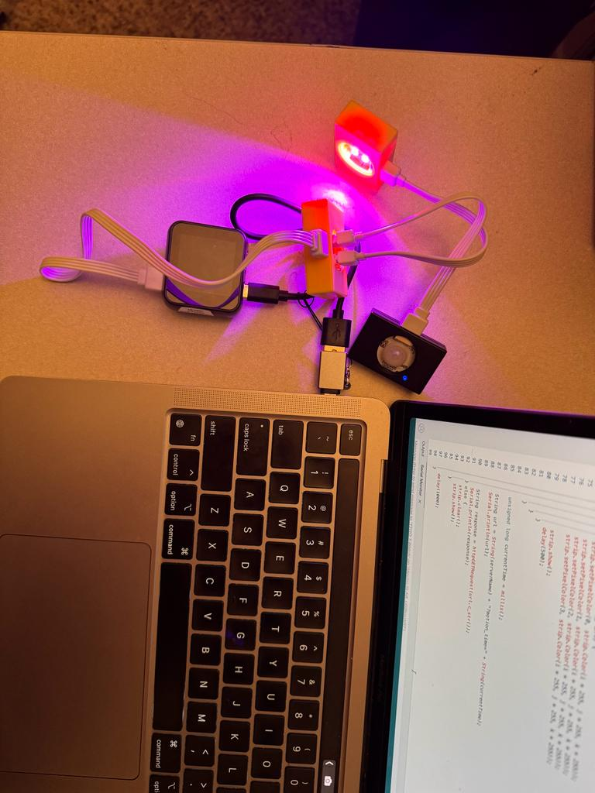

# IoT Ambient Lighting Project

## Overview

This IoT project is a sophisticated integration of cutting-edge technologies, combining a Passive Infrared (PIR) sensor for motion detection, a WS2812 RGB LED for visual feedback, and an ESP32 microcontroller for seamless control. The primary functionality centers around motion detection using the PIR sensor, triggering responses facilitated by the ESP32. Upon detecting motion, the system activates lighting for practical purposes while providing visual cues through the WS2812 RGB LED.

This dynamic interplay of motion detection and LED feedback enables the creation of versatile and interactive ambient lighting scenarios. The project's versatility makes it a valuable asset in various applications, from enhancing home automation systems to fortifying security measures or contributing to environmental control. With its comprehensive features, this IoT project represents a holistic approach to intelligent home systems, adding practical functionality and aesthetic appeal to modern living spaces.

## Features

- Motion detection using Passive Infrared (PIR) sensor
- Visual feedback through WS2812 RGB LED
- ESP32 microcontroller for seamless control
- Versatile and interactive ambient lighting scenarios
- Suitable for home automation, security enhancement, and environmental control

## Project Images

_Caption: Image showcasing the motion detection dashboard._

_Caption: Image showcasing the MongoDB instance._

_Caption: Image showcasing the our setup._

## Contributors

- Nishad Kale (ASU ID: 1226362919)

- Rahil Hastu (ASU ID: 1225356132)

## Regarding the video demonstration 
- The video demonstration is in the main not in this folder, please check. Thank you
